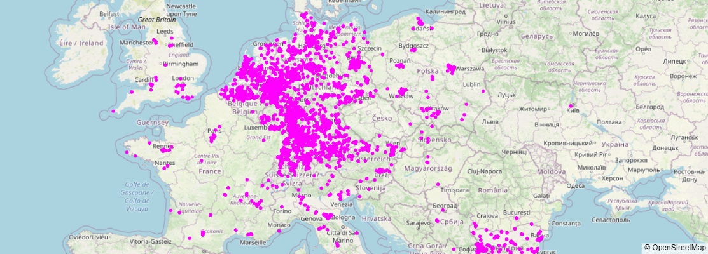
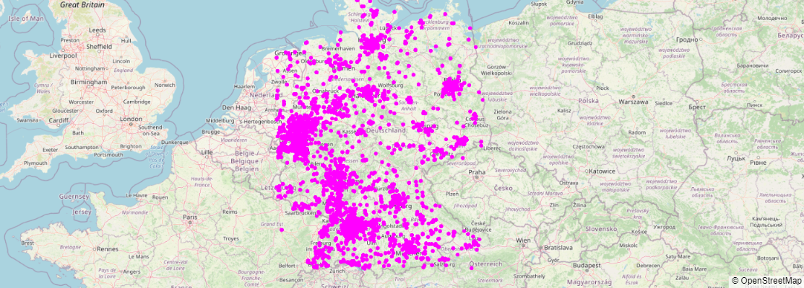
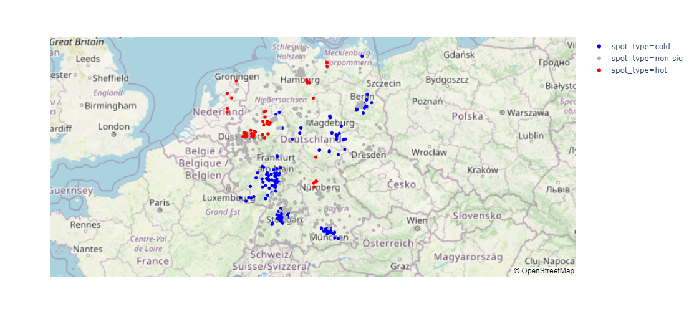

# Preview
This notebook is an academic mini-project  to apply aquired knowledge in  Big data course  with the suitable tools.
## About the Dataset 📖
1 million row of air quality data in Germany. Dataset is private and provided on request.
> Data mesuring date  : january 2019
## Goal 🛬
Implement Getis-Ord Gi* statistic to detect cold and hot spots using Apache Spark for air quality analytics in Germany. Results are demonstrative ie the data set used includes a million of measurements. accurate results will be obtained with full dataset

## Business understanding 
### ***Spatial autocorrelation***
Is whether points (in our case molecules in the air) that are close together are related to each other (i.e., are not spatially independent) as compared to those points farther apart. Spatial autocorrelation can be defined globally as well as locally based on the level of the spatial analysis units.
### ***Getis-Ord Gi**** ***statistic***

The Local Getis-Ord G* statistic calculate the Z-score which is used to determine where individuals with high or low values cluster spatially.

### ***PM2.5 and PM10***

In our Dataset PM2.5 and PM10 are reffered to respectively P2 and P1 (µg/m³) 

*   PM 2.5 refers to a category of particulate pollutant that is 2.5 microns or smaller in size.
*   PM 10 refers to a category of particulate pollutant that is 10 microns or bigger in size.

average PM2.5 (24h) | average PM10 (24h) | AQI category
--- | --- | ---
0 - 15.4 | 0 - 54 | Good
15.5 - 40.4  | 55 - 154 | Moderate
40.5 - 65.4 | 155 - 254 | USG 
65.5 - 150.4 | 255 -354  | Unhealthy 
150.5 - 250.4 | 355 - 424 | Very Unhealthy
250.5 - 500.4 | 425 - 604 | Hazardous

## Summary 🛫

1.   Setup
2.   Exploratory Data analysis
3.   Computing Spatial autocorrelation
4.   Visualizing hot and cold spots

---

Author © : [Med Fourat Ben Salah](mailto:mohamedfouratb@gmail.com)

 ---
### One day data plotting

### After filtering

### After detecting hot and cold spots

